<div align="center">
  
</div>

<h1 align="center">
  dionh.dev - v2
</h1>

<p align="center">
  The second iteration of <a href="https://dionh.dev" target="_blank">dionh.dev</a> built with <a href="https://react.dev/" target="_blank">React.js</a> and hosted with <a href="https://www.cloudflare.com/" target="_blank">Cloudflare Pages</a>
</p>

## Built With


 

## 📷 Photos
### Desktop View
#### Intro
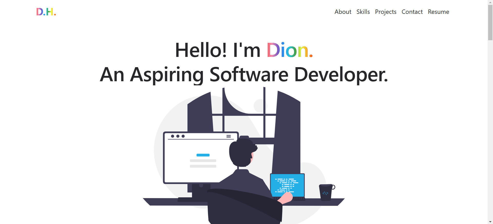
#### About
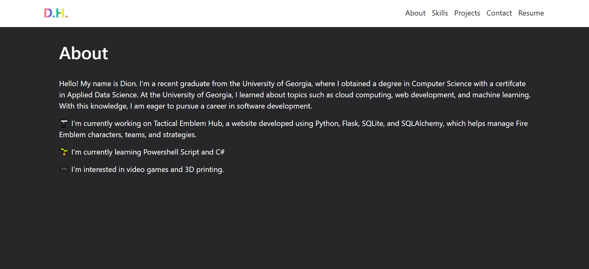
#### Skills
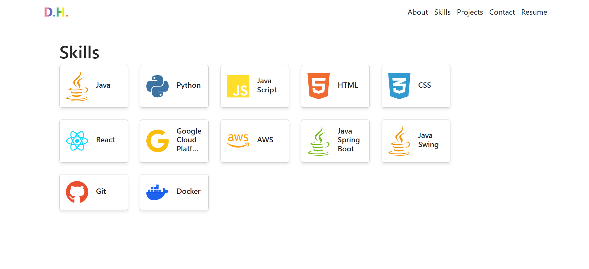
#### Projects
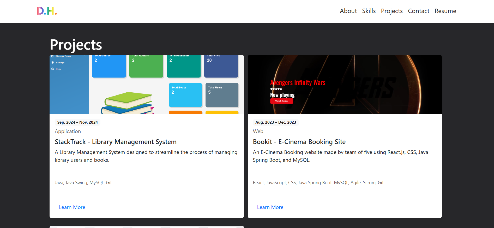
##### StackTrack
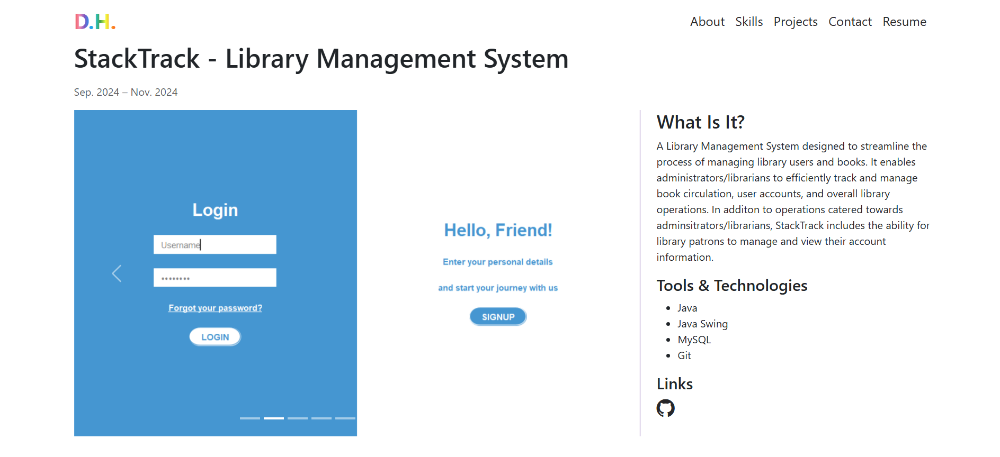
##### DCC
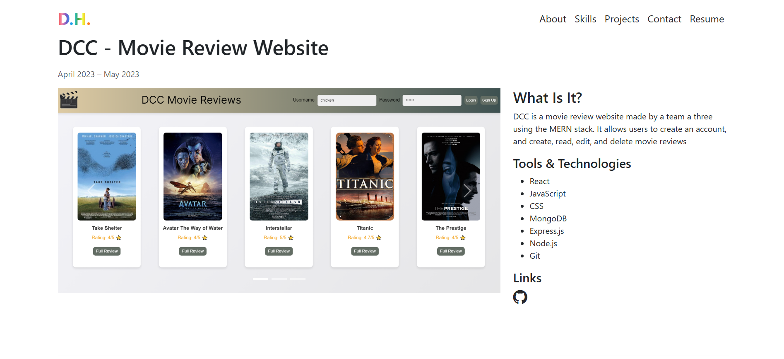
##### BookIt
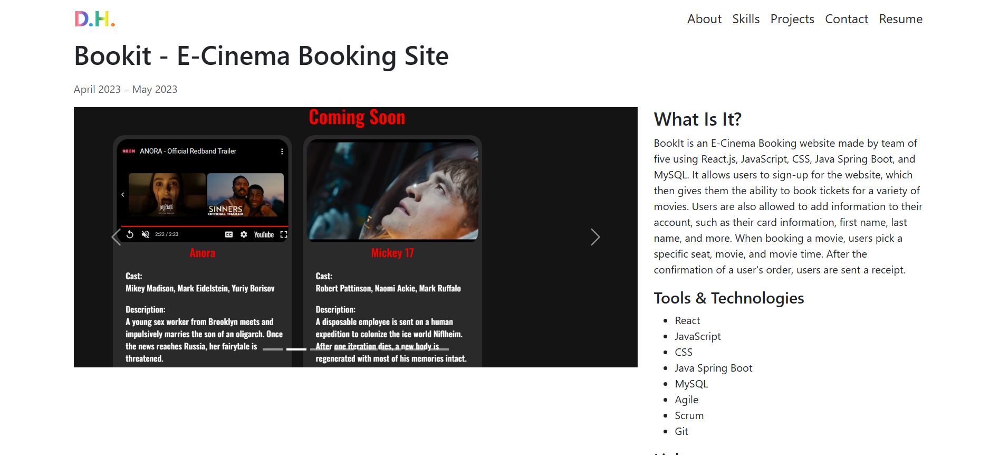
#### Contact
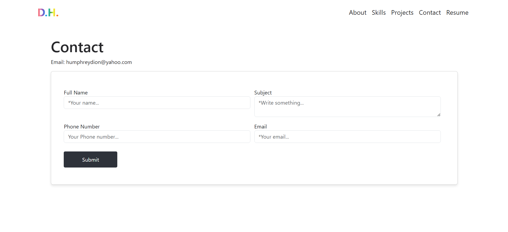
#### Footer
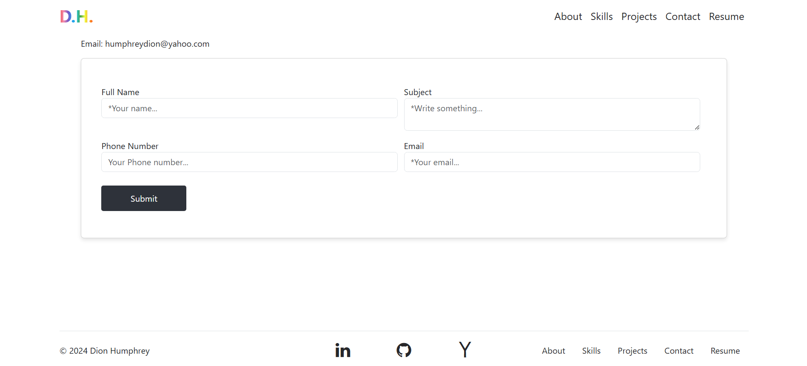
### Mobile View
#### Intro
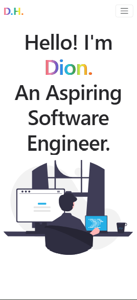
#### About
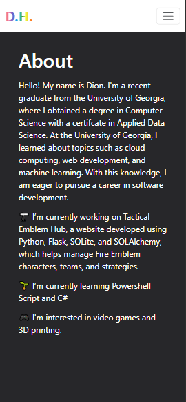
#### Skills
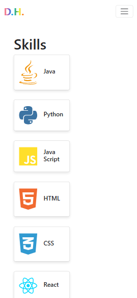
#### Projects

##### StackTrack
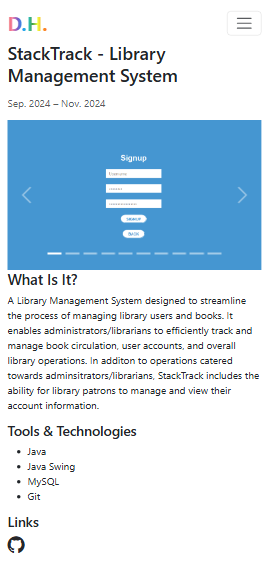
##### DCC
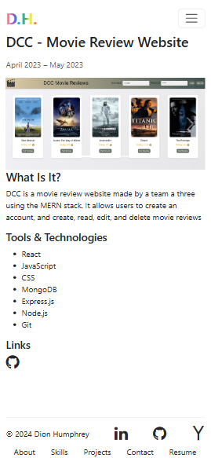
##### BookIt
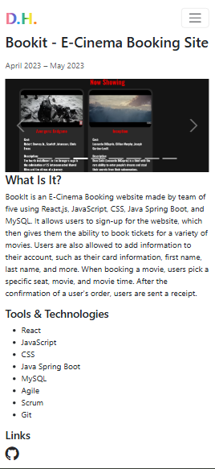
#### Contact
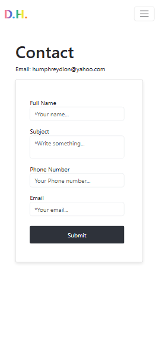
#### Footer
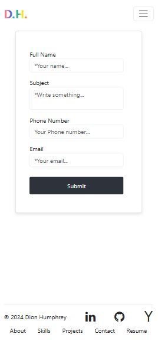
## 🛠 Installation & Set Up
1. Clone the Repo
    ```sh
   git clone https://github.com/GSDion/dh-website-v2.git
   ```
<!-- 2. Navigate to the directory 
    ```sh
   cd dh-website-v2
   ``` -->
2. Install node modules
    ```sh
   npm install
   ```
3. Start the development server
    ```sh
   npm start
   ```
## 🚀 Building and Running for Production
1. Generate a full static production build

   ```sh
   npm run build
   ```


